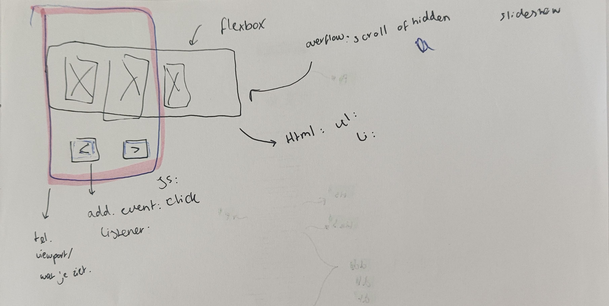

# Procesverslag
Markdown is een simpele manier om HTML te schrijven.  
Markdown cheat cheet: [Hulp bij het schrijven van Markdown](https://github.com/adam-p/markdown-here/wiki/Markdown-Cheatsheet).

Nb. De standaardstructuur en de spartaanse opmaak van de README.md zijn helemaal prima. Het gaat om de inhoud van je procesverslag. Besteedt de tijd voor pracht en praal aan je website.

Nb. Door *open* toe te voegen aan een *details* element kun je deze standaard open zetten. Fijn om dat steeds voor de relevante stuk(ken) te doen.

## Jij

  
uitwerken voor kick-off werkgroep

  ### Auteur:
  Sosan Shirzai

  #### Je startniveau:
  Blauw

  #### Je focus:
  Responsive plane
 

## Je website

  
uitwerken voor kick-off werkgroep

  ### Je opdracht:
  Lucardi.nl

  #### Screenshot(s) van de eerste pagina (small screen): 
  Homepage van lucardi.nl
  
  #### Screenshot(s) van de tweede pagina (small screen):
  Artikelpagina van artikel op lucardi
  
 

## Toegankelijkheidstest 1/2 (week 1)

  
uitwerken na test in 2e werkgroep

  ### Bevindingen
  Lijst met je bevindingen die in de test naar voren kwamen:
  Ik heb Safae haar website gecheckt met een screenreader op mijn macbook.
  Haar website was die van pllaystation 5. De link naar de website: 

  Ik heb hier mijn bevindingen in een lijst met bullets gezet:

  De screenreader:

  <ul>
  <li> De screen reader werkt wel goed bij de navigatiebalk.
  <li> Niet alle afbeeldingen of vectorshadden een extra tekst eronder. Dit zorgde voor veel verwarring waardoor ik alleen "Image.....Image......Image" te horen kreeg. Wel een pluspunt is dat de meeste afbeeldingen wel een alt tekstje hadden. Dus je wist over welke games het ging.
  <li> Er is gelukkig een button met naar hoofdcontent gaan, zodat je niet de hele website af moet.
  <li> Bij een video dat zich afspeelt is er een pauze button. Er wordt geen context gegeven over waar die pauze button is en de video zelf heeft ook geen uitleg.
  <li> De meeste tekst was in het nederlands, maar werd voorgelezen in het engels. Dit maakt het onverstaanbaar en niet te begrijpen.
  <li> Er is een slideshow met games en er werd maar 1 game opgenoemt, voor de rest las het de balkje voor als: "Button...........Button.............Button".
  </ul>

  Voor de rest hadden wij tijdens de les nog brillen opgedaan en een machine getest die schokjes gaf en je hetzelfde bibber handen gaf net als Parkinsons. 
  Het was erg moeilijk om te lezen en en om iets op de zoekbalk te schrijven op de laptop.
  Al in al, de ervaring was erg frustrerend. Nu begrijp ik waarom er meer aandacht moet komen voor toegankelijkheid. Ik vind het knap hoe mensen met een beperking het tot nu toe doen op het internet of uberhaupt met moderne technologie. Ik heb enorme respect voor deze mensen.

## Breakdownschets (week 1)

  
uitwerken na afloop 3e werkgroep

  ### de hele pagina (main scherm): 
  

  ### de hele pagina (artikel scherm):
  

  

  ### dynamisch deel (Review section): 
  

  ### wellicht nog een dynamisch deel (Automatische slideshow): 
  

## Voortgang 1 (week 2)

  
uitwerken voor 1e voortgang

  ### Stand van zaken
  Met het opstellen van een html-pagina ging het best prima. Ik was bij de artikel omschrijvingen wel in de war, want ik wist niet hoe ik de dl, dt tag moest toepassen om de uitklapmenu moest krijgen. Voor de rest, dit is iets voor mijzelf om mee te nemen voor de rest van mijn projecten ooit: download de foto's gelijk!!! Mijn website is snel verandert van acties, dus ik zocht met moeite alle structuur en foto's op via mijn github website screenshot.

  ### Agenda voor meeting
  samen met je groepje opstellen

  | student 1: Sosan      | student 2: Demi          | student 3: Chiara    | student 4        |
  | ---            | ---                | ---          | ---              |
  | HTML slideshow bespreken  | Hoe zet je een button over de image             | Classes speciferen, hoe en wanneer?    | en dan ik dat    |
  | Details, dt en dd tags toepassing in code | dit als er tijd is | nog een punt | dit wil ik zeker |
  | ...            | ...                | ...          | ...              |

  ### Verslag van meeting
  hier na afloop snel de uitkomsten van de meeting vastleggen

  - De details and summary tags zijn goed toegepast op de code, je hoeft het niet apart te stylen om die effect te krijgen.
  - De nav mag in de header. De header tag kwam er niet voor. Ook kan er ul en li's gebruikt worden.
  - Nog aandacht besteden aan de H1, H2 en H3's hoe die gebruikt wordt. Want er word van de een naar de ander gesprongen, denk er goed over na.
  - Slideshow kan simpel met flexbox etc....

  Bronnen gebruikt: Bron 1.

## Voortgang 2 (week 3)

  
uitwerken voor 2e voortgang

  ### Stand van zaken
  hier dit ging goed & dit was lastig (neem ook screenshots op van delen van je website en code)

  ### Agenda voor meeting
  samen met je groepje opstellen

  | student 1      | student 2          | student 3    | student 4        |
  | ---            | ---                | ---          | ---              |
  | Html structuur  | en dit             | en ik dit    | en dan ik dat    |
  | aanpak welke namaken en css | dit als er tijd is | nog een punt | dit wil ik zeker |
  | ...            | ...                | ...          | ...              |

  ### Verslag van meeting
  hier na afloop snel de uitkomsten van de meeting vastleggen

  - punt 1
  - punt 2
  - nog een punt
- ...

## Toegankelijkheidstest 2/2 (week 4)

  
uitwerken na test in 9e werkgroep

  ### Bevindingen
  Lijst met je bevindingen die in de test naar voren kwamen (geef ook aan wat er verbeterd is):

  Als ik de test doe met de voiceover, merk ik dat de screenreader niet alle tekst voorleest. De details summary tekst leest die voor. Alleen niet wat de inhoud is. Ook kan ik niet met alles interacteren bv. de buttons bij het liken van de een product op de homepage.

  Bij de ally checker zie ik dat ik nog een paar dingen mis:
  - Ik mis de left aligned text bij de content.
  - Je kan haast niet navigeren met de keyboard. Het leest niet alles voor.
  - Ik kan fieldset en legend gebruiken bij de artikelpagina, vooral bij de filter.
  - Mijn animatie voldoet niet reduced-motion.
  - De kleurencontrast h1 is niet goed.

## Voortgang 3 (week 4)

  
uitwerken voor 3e voortgang

  ### Stand van zaken
  hier dit ging goed & dit was lastig (neem ook screenshots op van delen van je website en code)

  ### Agenda voor meeting
  samen met je groepje opstellen

  | student 1      | student 2          | student 3    | student 4        |
  | ---            | ---                | ---          | ---              |
  | dit bespreken  | en dit             | en ik dit    | en dan ik dat    |
  | en dat ook nog | dit als er tijd is | nog een punt | dit wil ik zeker |
  | ...            | ...                | ...          | ...              |

  ### Verslag van meeting
  hier na afloop snel de uitkomsten van de meeting vastleggen

  - punt 1
  - punt 2
  - nog een punt
  - ...

## Eindgesprek (week 5)

  
uitwerken voor eindgesprek

  ### Je uitkomst - karakteristiek screenshots:
  

  ### Dit ging goed/Heb ik geleerd: 
  Ik heb geleerd hoe je een carousel kan maken. Dit duurde wel even voordat ik het door had, maar dit ging goed.
  Wat het beste ging was dingen positioneren.

  
   

  ### Dit was lastig/Is niet gelukt:
  Korte omschrijving met plaatjes
  Ik vond het lastig om de animatie te doen met de plusje bij de details. Vooral het javascript gedeelte vond ik het moeilijkst. 
Ook het verwerken van de light en dark mode in de website vond ik moeilijk. Ik wou dingen wat lichter maken, want sommige dingen zijn haast niet te lezden. 
Ik had gezien dat het makkelijker kon als ik custom properties meer had gebruikt, daar heb ik ook spijt van.
Al in al het lastigste waren de animaties,javascript en dark en light modus.

  

## Bronnenlijst

  
continu bijhouden terwijl je werkt

  Nb. Wees specifiek ('css-tricks' als bron is bijv. niet specifiek genoeg). 
  Nb. ChatGpT en andere AI horen er ook bij.
  Nb. Vermeld de bronnen ook in je code.

  1. W3Schools.com. (12-9-2024). https://www.w3schools.com/tags/tag_dd.asp
  2. Hmaburger menu website: Repo, S., Repo, S., Repo, S., Repo, S., Repo, S., Repo, S., Repo, S., Repo, S., Repo, S., Repo, S., Repo, S., Repo, S., Repo, S., Repo, S., Repo, S., Repo, S., Repo, S., Repo, S., Repo, S., . . . Repo, S. (n.d.). Hamburger Menu Vector SVG Icon - SVG Repo. SVG Repo. https://www.svgrepo.com/svg/312300/hamburger-menu
  3. https://www.w3schools.com/tags/ref_pxtoemconversion.asp
  4. https://stackoverflow.com/questions/1734618/how-to-increase-the-gap-between-text-and-underlining-in-css underline offset.
  5. Coding2GO. (2024, June 16). Learn CSS Animations in 9 Minutes [Video]. YouTube. https://www.youtube.com/watch?v=z2LQYsZhsFw voor animaties
  6. CSSnippets. (2024, November 28). Master CSS Animation Property in 11 minutes [Full Tutorial] 🚀 [Video]. YouTube. https://www.youtube.com/watch?v=Bhj4miRkSOc voor animaties
  7. Fireship. (2020, April 21). CSS animation in 100 seconds [Video]. YouTube. https://www.youtube.com/watch?v=HZHHBwzmJLk voor animaties
  8. Cascading Style. (2020, June 6). Animated Skill Bar using HTML & CSS | Cascading Style [Video]. YouTube. https://www.youtube.com/watch?v=EoN_4fv3T7A voor review bar 
  9. CSS Dev and UX. (2020, August 31). Detail and Summary tag in HTML with CSS styling and transitions [Video]. YouTube. https://www.youtube.com/watch?v=4NAUHt8gebo detail summary styling
  10. Bellamy-Royds, A. (2022, September 30). How to scale SVG | CSS-Tricks. CSS-Tricks. https://css-tricks.com/scale-svg/ voor alle svg's
  11. grid-template-columns - CSS: Cascading Style Sheets | MDN. (2024, October 8). MDN Web Docs. https://developer.mozilla.org/en-US/docs/Web/CSS/grid-template-columns grid voor paarse blok footer
  12. Code Instinct. (2018b, December 31). Auto Image Slideshow using HTML and CSS [Video]. YouTube. https://www.youtube.com/watch?v=j18CH0Grhbw slideshows
  13. font-size-adjust - CSS: Cascading Style Sheets | MDN. (2024, December 19). MDN Web Docs. https://developer.mozilla.org/en-US/docs/Web/CSS/font-size-adjust overal bij fonts
  14. W3Schools.com. (n.d.). https://www.w3schools.com/css/css3_buttons.asp styling bij buttons
  15. CodingNepal. (2023, September 2). Create responsive image slider in HTML CSS and JavaScript | Image Slider HTML CSS & JavaScript [Video]. YouTube. https://www.youtube.com/watch?v=PsNaoDhzQm0 image slider artikelen
  16. CodingNepal. (2022, October 31). Create a draggable image slider in HTML CSS & JavaScript | Mobile friendly slider in JavaScript [Video]. YouTube. https://www.youtube.com/watch?v=7HPsdVQhpRw image slider artikelen
  17. CodingNepal. (2022b, October 31). Create a draggable image slider in HTML CSS & JavaScript | Mobile friendly slider in JavaScript [Video]. YouTube. https://www.youtube.com/watch?v=7HPsdVQhpRw image slider artikelen
18. CodingNepal. (2023a, April 22). Create a draggable card slider in HTML CSS & JavaScript | Infinite Image slider in JavaScript [Video]. YouTube. https://www.youtube.com/watch?v=6QE8dXq9SOE image slider artikelen
19. W3Schools.com. (n.d.-b). https://www.w3schools.com/cssref/css3_pr_column-gap.php column gap bij paarse footer blok
20. Removing grid gaps. (n.d.). Stack Overflow. https://stackoverflow.com/questions/50504828/removing-grid-gaps column gap bij paarse footer blok
21. CodingNepal. (2024, June 30). Create responsive card slider in HTML CSS & JavaScript | Step-by-Step tutorial [Video]. YouTube. https://www.youtube.com/watch?v=XxG7vqFecR8 image slider.
22. CodingNepal. (2022c, October 31). Create a draggable image slider in HTML CSS & JavaScript | Mobile friendly slider in JavaScript [Video]. YouTube. https://www.youtube.com/watch?v=7HPsdVQhpRw
 23. CodingLab. (2022, January 22). How to make Card Slider in HTML CSS & JavaScript [Video]. YouTube. https://www.youtube.com/watch?v=BKKcGb80MOs cards maken voor image slider
24. CodingNepal. (2024b, August 24). How to create responsive card slider in HTML CSS & JavaScript | Step-by-Step tutorial [Video]. YouTube. https://www.youtube.com/watch?v=VUtJ7FWCfZA cards maken voor image slider
25. CodingNepal. (2023b, April 22). Create a draggable card slider in HTML CSS & JavaScript | Infinite Image slider in JavaScript [Video]. YouTube. https://www.youtube.com/watch?v=6QE8dXq9SOE cards maken voor image slider
26. W3Schools.com. (n.d.-c). https://www.w3schools.com/cssref/css3_pr_filter.php filter voor menu
27. Olawanle, J. (2023, June 22). CSS Image Styling: Enhancing Visual Appeal with Style. Kinsta®. https://kinsta.com/blog/css-image-styling/ header foto
28. box-shadow - CSS: Cascading Style Sheets | MDN. (2024, August 13). MDN Web Docs. https://developer.mozilla.org/en-US/docs/Web/CSS/box-shadow pop-up bij filter
29. The Web School. (2022, January 10). Perfect image fit in CSS [Video]. YouTube. https://www.youtube.com/watch?v=-4-COv3tY0I styling header foto
30. max-height - CSS: Cascading Style Sheets | MDN. (2024, December 19). MDN Web Docs. https://developer.mozilla.org/en-US/docs/Web/CSS/max-height bij max-height
37. CSS - display elements in columns. (n.d.). Stack Overflow. https://stackoverflow.com/questions/56732889/css-display-elements-in-columns paarse blok footer
38. border-bottom-style - CSS: Cascading Style Sheets | MDN. (2024, July 26). MDN Web Docs. https://developer.mozilla.org/en-US/docs/Web/CSS/border-bottom-style bottom style styling
39. - YouTube. (n.d.). https://www.youtube.com/shorts/xvTWmWG6liM text carousel bovenaan
40. Coding Artist. (2021, August 27). Auto Image Slideshow | HTML & CSS Tutorial | with Source code [Video]. YouTube. https://www.youtube.com/watch?v=4K9eI6FhyI4 text carousel
41. - YouTube. (n.d.-b). https://www.youtube.com/shorts/W2yJ_IbkAyI image slider
42. box-sizing - CSS: Cascading Style Sheets | MDN. (2024, July 26). MDN Web Docs. https://developer.mozilla.org/en-US/docs/Web/CSS/box-sizing box sizing in het algemeen
43. :focus-visible - CSS: Cascading Style Sheets | MDN. (2024, November 26). MDN Web Docs. https://developer.mozilla.org/en-US/docs/Web/CSS/:focus-visible bij css
44. Kevin Powell. (2016, December 21). Tutorial: Learn how to use CSS Media Queries in less than 5 minutes [Video]. YouTube. https://www.youtube.com/watch?v=2KL-z9A56SQ dark en light query
45. How to remove blue-box-fill when clicking the buttons? (n.d.). Stack Overflow. https://stackoverflow.com/questions/62948004/how-to-remove-blue-box-fill-when-clicking-the-buttons bij a hrefs css
46. Alle sanne oefeningen die op dlo staan, maar vooral de animatie oefeningen en de menu oefening.

